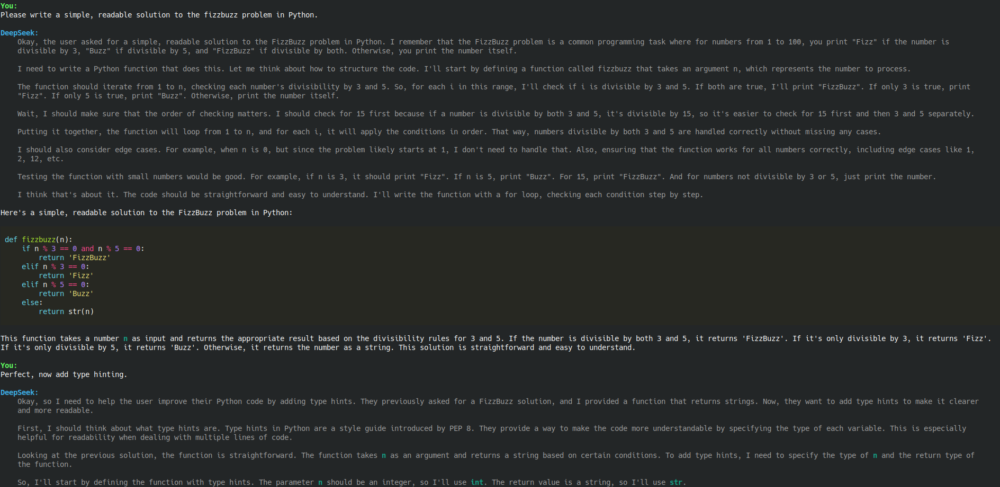

# DeepSeek Test Project

## A Conversational AI Example using DeepSeek AI and PyTorch

This project demonstrates a simple prompt-response loop using the DeepSeek AI model. The conversation history is maintained in memory, allowing for a basic conversational flow.



## Getting Started

### Installation

After cloning the repository, install the required dependencies using the following command:

```bash
pip install -r requirements.txt
```

### Running the Project

To start the prompt-response loop, execute the following command:

```bash
python main.py
```

This will initiate the conversational AI loop, where you can input messages and receive responses from the DeepSeek AI assistant.

### Project Details

- The project utilizes a locally run [`deepseek-ai/DeepSeek-R1-Distill-Qwen-1.5B`](https://huggingface.co/deepseek-ai/DeepSeek-R1-Distill-Qwen-1.5B) model from the Hugging Face model hub. To use a different model, simply modify the `model_ident` parameter in the DeepSeekChat class.

- This project is intended for educational purposes only and should not be used in production without further modifications.

## Usage Notes

- The conversational AI loop will continue until the maximum number of generations per prompt is reached or the assistant concludes on its own.

## License

This project is licensed under the [MIT License](LICENSE).
